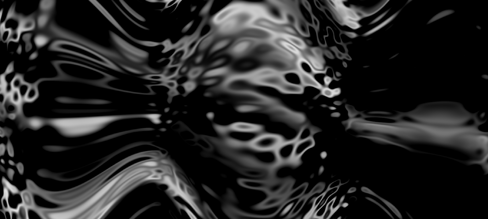

[demo](https://hydra.ojack.xyz/?code=YS5zZXRCaW5zKDQpJTBBYS5zZXRTbW9vdGgoMC45KSUwQW5vaXNlKCgpJTNEJTNFYS5mZnQlNUIyJTVEKjEwJTJCNSUyQzAuMSUyQzAuMiklMEEubW9kdWxhdGUobm9pc2UoMjAlMkMwLjElMkMwLjIpKSUwQS5tb2R1bGF0ZVNjYWxlKG9zYygxNSUyQzAuMDElMkMwLjAzKSklMEElMkYlMkYlMjAuc3F1cmUoMiUyQzAlMkMzKSUwQS5vdXQobzAp)



```code
a.setBins(4)
a.setSmooth(0.9)
noise(()=>a.fft[2]*10+5,0.1,0.2)
.modulate(noise(20,0.1,0.2))
.modulateScale(osc(15,0.01,0.03))
.out(o0)
```